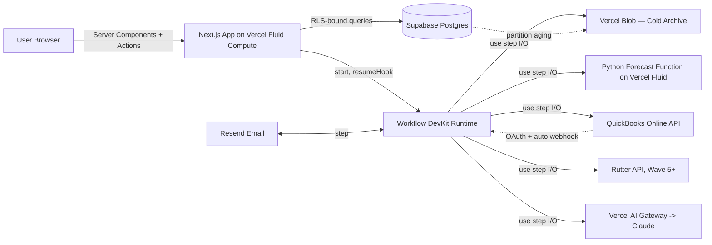
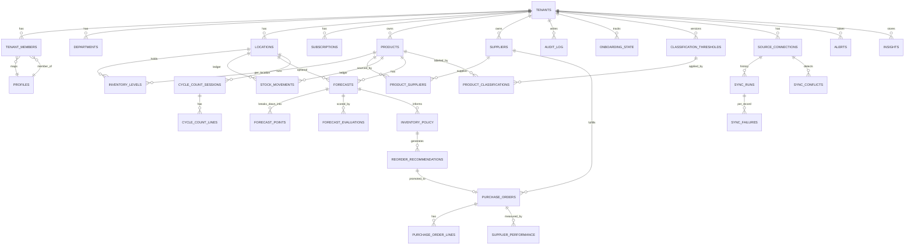
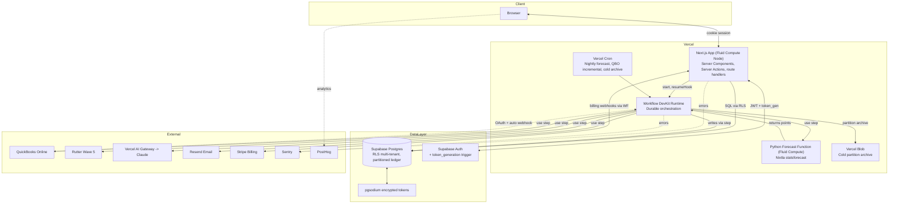

# The Chain — System Design
*Phase 2 artifact. Required by PROCESS.md.*
*Created: 2026-05-30. Revised: 2026-05-30 (post-Codex Beat 4: contracts tightened, security holes closed, tier-gated retention added).*
*Type: MoreTech Product (internal, in-house)*

> The bar: clean, structured, scalable. Someone joining the project reads this and knows the shape of the system in 10 minutes.
>
> **Operating principle:** architect for the full vision (multi-tenant, multi-location, multi-user with roles, supplier scorecards, audit log, two-way ERP sync, ABC/XYZ, cycle counts, ROI tracking, distribution-ERP-native adapters), release in waves. **No future wave requires a schema change or foundational refactor.** This document commits the contracts that make that true.
>
> **Revision note:** v1 of this doc surfaced real gaps in adapter contracts, conflict resolution, RLS specificity, recommendation lifecycle, tenant switching, alert dedupe, retention strategy, and forecast fan-out. v2 closes them.

## Architecture overview



Every customer-visible interaction is a Server Component read or a Server Action mutation. Every multi-step, retryable, or crash-sensitive operation (QBO sync, forecast batches, PO lifecycle, onboarding, alert generation, cold-archive jobs, future Rutter sync) is a `"use workflow"` orchestrator calling `"use step"` units. Every state change writes an `audit_log` row. The canonical inventory and sales model lives in Supabase Postgres with RLS keyed on `tenant_id`. UI surfaces (single-location single-user in Wave 1, multi-location in Wave 2, role-based in Wave 3, cycle counts in Wave 4, etc.) are added on top of this layer without schema change.

## Frontend architecture
- **Framework + version:** Next.js (App Router) on the current LTS, React 19, Tailwind CSS 4, TypeScript strict mode. Default Node.js runtime (24 LTS).
- **Routing model:** App Router with nested layouts. Top-level segments: `/(marketing)`, `/(auth)`, `/(app)`. The `(app)` segment is gated by Supabase session + an active-tenant resolver (see Auth section). Parallel routes for dashboard panes.
- **State management:** Server-first. Server Components own data fetching. Server Actions own mutations. Client islands use React local state plus URL search params for filters. No global client store.
- **Rendering model:** Server Components by default. `'use cache'` directives for tenant-scoped data with `cacheTag()` keyed on `tenant_id` + entity kind so mutations can revalidate precisely. Mutations through Server Actions call `revalidateTag()` on affected tags. No Edge runtime; Fluid Compute Node handles everything including middleware.
- **Why these choices:** Server-first delivers fast time-to-content for distributors loading dashboards with thousands of SKUs. Cache components plus precise tag invalidation give us multi-tenant correctness without a Redis layer. App Router supports the wave-by-wave UI build with minimal coupling between segments.

## Backend architecture
- **Server runtime:** Vercel Fluid Compute (Node.js 24 LTS) for the Next.js app, route handlers, Server Actions, and Workflow step functions. Python 3.13 on Vercel Fluid for the forecasting function.
- **Deploy target:** Single Vercel project with two functions: the Next.js app (Node) and the forecasting endpoint (Python). Workflow DevKit runtime is the durable orchestrator, deployed alongside the app via `@workflow/next`.
- **Function model:**
  - **Request/response** (Server Actions, route handlers, Server Components): Fluid Compute Node.
  - **Durable orchestration** (`"use workflow"`): Workflow DevKit. Survives crashes; supports `sleep()`, `createHook()`, `createWebhook()`, automatic retries, replay-safe.
  - **Heavy compute units** (`"use step"`): full Node.js access, automatic retries, results persisted for replay. **All database writes happen inside steps**, never inside the Python forecast function directly. Python returns forecast point arrays; the calling step persists them with idempotency keys.
  - **Forecasting** (Python): one entrypoint, accepts a series (SKU, optional location, history, target horizon, seasonality hint) and returns forecast points + diagnostics. Stateless. Step writes the result.
  - **Cron**: `vercel.ts` schedules the nightly per-tenant forecast workflow, periodic QBO incremental sync per connection, and the daily cold-archive partition job.
- **Why these choices:** Workflow DevKit is the right primitive for two-way ERP sync (idempotent retries, hook-based wait, crash-safe replay). Steps avoid the workflow VM sandbox so real I/O is unconstrained and database writes are controlled. Python on Fluid keeps the mature statistical-forecasting stack (`statsforecast`) without a separate microservice.

## API structure and flow
Two API surfaces: **Server Actions** for in-app mutations (typed, RSC-friendly), and **route handlers** for OAuth callbacks, exports, and the `createHook` resume endpoint. (Workflow webhooks via `createWebhook()` are auto-addressable at `/.well-known/workflow/v1/webhook/:token` and need no manual route.)

### Server Actions (representative)
All actions: authenticated via Supabase session, scoped to the **active tenant** resolved from the JWT claim, RLS-enforced at the DB layer, role-gated where the matrix below applies. Return shape: `{ ok: true, data } | { ok: false, error }`. **Every mutation that triggers external writes accepts an `idempotency_key`.**

- `switchActiveTenant(tenantId)` — sets `profiles.active_tenant_id`, forces a JWT refresh, returns the new session. Audit-logged.
- `connectQboAccount(state) -> { authorizationUrl }` — initiates OAuth.
- `importCatalogFromCsv(file) -> { jobRunId }` — kicks off `onboardingWorkflow`.
- `runCatalogSync(connectionId) -> { workflowRunId }` — kicks off `qboIncrementalSyncWorkflow`.
- `recomputeForecast(productId?, locationId?) -> { workflowRunId }` — on-demand forecast recompute.
- `generateRecommendations(scope: 'tenant' | 'location' | 'product') -> { workflowRunId }` — kicks off recommendation generation (writes `reorder_recommendations`).
- `convertRecommendationToPo(recommendationId, edits?) -> { purchaseOrderId }` — promotes a recommendation; sets `reorder_recommendations.status='converted'`.
- `approvePurchaseOrder(poId, idempotency_key) -> { exported: boolean }` — triggers `purchaseOrderLifecycleWorkflow`.
- `markPurchaseOrderReceived(poId, lines[], idempotency_key) -> { updatedStock }` — writes receipt; resumes a hook on the lifecycle workflow if one is waiting.
- `resolveSyncConflict(conflictId, resolution: 'accept_local' | 'accept_remote' | 'merge', merge_payload?) -> {}` — operator-driven resolution path.
- `acknowledgeAlert(alertId) -> {}` / `dismissAlert(alertId, reason) -> {}`.

### Route handlers (representative)
- `GET /api/qbo/oauth/callback` — Intuit OAuth redirect target. Exchanges code, stores `pgsodium`-encrypted tokens, redirects to `/app/integrations`.
- `POST /.well-known/workflow/v1/webhook/:token` — **Workflow DevKit auto-addressable webhook endpoint.** Used for `createWebhook()` random-token callbacks (QBO entity push, Stripe billing events). No custom code.
- `POST /api/workflows/hook/[token]` — wraps `resumeHook(token, payload)`. Used by internal server-side resume calls with deterministic tokens (e.g., resuming `purchaseOrderLifecycleWorkflow` on receipt).
- `GET /api/exports/po/[poId].csv` — exports an approved PO.
- `GET /api/exports/inventory.csv` — full inventory snapshot for the active tenant.
- `GET /api/exports/audit/[period].csv` — tier-gated audit export (see Retention section).

### Workflow DevKit orchestrations (Wave 1)
Each is a `"use workflow"` function. Logic lives in `"use step"` units with full Node access.

- **`qboInitialSyncWorkflow(connectionId)`** — full pull of items, vendors, POs, inventory, sales transactions. Cursors persisted between steps via `sync_runs.cursor`. Drives the existing-business onboarding path.
- **`qboIncrementalSyncWorkflow(connectionId, since)`** — periodic delta sync. Triggered by cron and by Intuit's auto-webhook (Workflow DevKit `createWebhook()`). Applies the **split conflict policy** below.
- **`forecastTenantBatchWorkflow(tenantId)`** — fans out per-SKU jobs to the Python function via shard sub-workflows. See **Forecast batch + fan-out contract** below.
- **`alertGenerationWorkflow(tenantId)`** — runs after the forecast batch. Walks `inventory_policy` + `purchase_orders` + `forecast_evaluations`. Emits / updates `alerts` per the dedupe contract.
- **`purchaseOrderLifecycleWorkflow(poId)`** — orchestrates approve → write-back to QBO via step → wait for `mark received` hook → close. Survives long `sleep()` between approval and receipt.
- **`onboardingWorkflow(tenantId, path: 'qbo' | 'csv' | 'fresh')`** — guides the tenant through connection or fresh-start setup. Enforces minimum-field requirements (see Onboarding minimums below) before declaring the tenant "ready."
- **`coldArchiveWorkflow()`** — daily cron job. Detaches Postgres partitions older than the global retention floor and uploads to Vercel Blob. Idempotent.
- **`syncFailureRecoveryWorkflow(failureId)`** — retries `sync_failures` entries with backoff; escalates to dead-letter after N attempts.

### Conflict resolution contract (split policy)
Codified per MG decision 2026-05-30.

- **POs The Chain generated** (`purchase_orders.recommended_by != 'external'` or `purchase_orders.created_by_user_id is not null`): **server-wins.** If QBO returns a divergent state, we overwrite QBO with our state, write a `sync_conflicts` row noting what was overwritten, and emit a `sync_conflict` alert at `info` severity.
- **Catalog and vendor edits** (`products`, `suppliers`, `product_suppliers`): **last-write-wins** by `updated_at` comparison between local and `external_updated_at`. The losing side is logged in `sync_conflicts`. Alerts at `info` severity.
- **Receipts and stock movements**: never overwritten. Both sides retained as separate `stock_movements` rows with `source` distinguishing them; reconciliation surfaces as an `info` alert if quantities diverge by more than tolerance.
- **Any conflict the policy cannot resolve** writes a `sync_conflicts` row with `status='needs_review'` and surfaces a `warn` alert. `resolveSyncConflict` Server Action lets an owner pick.

### Error model
- Inside workflows and steps: `RetryableError` for transient failures (network, rate limit, 5xx) with `retryAfter`. `FatalError` for permanent failures (4xx auth, schema mismatch, validation).
- `sync_failures` table durably records failed records per `sync_run` with `retry_count`, `next_retry_at`, `dead_letter` flag.
- Server Actions: typed errors returned in the result envelope. Never throw raw; mapped to (`AUTH_REQUIRED`, `VALIDATION`, `NOT_FOUND`, `CONFLICT`, `INTEGRATION_ERROR`, `RATE_LIMITED`).
- Route handlers: standard HTTP codes + JSON error body matching the same taxonomy.

## Database schema

Multi-tenant single-schema in Supabase Postgres. **Every row in tenant data tables carries `tenant_id uuid not null`, including child tables**, so RLS predicates can be evaluated without a join. The redundancy is intentional and pays for itself in cache and policy simplicity. RLS reads the JWT claim populated by a Supabase auth hook.



### Tables

**Identity, tenancy, billing**
- `tenants` (id uuid pk, name, slug unique, created_at, deleted_at). One row per customer business.
- `profiles` (user_id uuid pk references auth.users, display_name, avatar_url, active_tenant_id uuid). `active_tenant_id` drives the JWT claim. Switching tenants updates this row and refreshes the session.
- `tenant_members` (tenant_id, user_id, role enum: owner/manager/planner/warehouse/finance/viewer, department_id nullable, created_at, primary key (tenant_id, user_id)). Multi-user with roles wired from Wave 1; UI exposes only owner in Wave 1.
- `departments` (tenant_id, id, name, created_at).
- `subscriptions` (tenant_id pk, status enum: trial/active/past_due/canceled/comp, trial_start, trial_end, plan_code, retention_tier enum: free/starter/standard/pro/enterprise, billing_customer_id, billing_provider, updated_at). `retention_tier` drives the hot-window for `audit_log` and `stock_movements`.

**Locations and inventory**
- `locations` (tenant_id, id, name, type enum: warehouse/store/plant/third_party/consignment, address jsonb, active, **location_kind text nullable** (W2-2: 'stockroom' now; later van/job_site/cabinet/wip/quarantine), created_at). Multi-location wired from Wave 1; Wave 1 UI shows a single auto-created "Main" location per tenant.
- `products` (tenant_id, id, sku, name, description, unit_of_measure, attributes jsonb, status enum: active/discontinued, primary_supplier_id nullable, external_ids jsonb, external_updated_at, created_at, updated_at). Unique (tenant_id, sku). `external_ids` carries source-namespaced IDs (e.g., `{ qbo: '12345' }`).
- `product_classifications` (tenant_id, product_id, location_id nullable, abc_class char(1), xyz_class char(1), adi numeric, cv_squared numeric, annual_consumption_value numeric, revenue_basis enum: cost/price, threshold_version_id uuid, computed_at, primary key (tenant_id, product_id, location_id)). Supports both tenant-wide and location-specific classification.
- `classification_thresholds` (id uuid, tenant_id, version int, abc_cuts numeric[3], xyz_cuts numeric[2], created_at). Versioned ABC/XYZ cutoffs so reclassification is auditable.
- `inventory_levels` (tenant_id, product_id, location_id, on_hand numeric, allocated numeric, in_transit numeric, last_counted_at, updated_at, primary key (tenant_id, product_id, location_id)). Indexed on (tenant_id, location_id) and (tenant_id, product_id).
- `stock_movements` (id, tenant_id, product_id, location_id, type enum: sale/receipt/transfer_in/transfer_out/adjustment/cycle_count/**issue_out/issue_return/return_to_vendor/customer_return** (W2-2), quantity numeric, source enum: qbo/csv/manual/api/workflow/rutter, source_ref text, **demand_ref_type text nullable** (work_order/crew/cost_center — the polymorphic consuming-object envelope), **demand_ref_id text nullable** (free-text ref, intentionally NOT a FK), **reason_code text nullable**, **note text nullable**, occurred_at, created_at). Append-only ledger. **Partitioned by RANGE(occurred_at) yearly.** Indexes: (tenant_id, product_id, occurred_at), (tenant_id, location_id, occurred_at), partial (tenant_id, demand_ref_type, demand_ref_id, occurred_at) where demand_ref_id is not null. CHECKs (W2-2): issue_out needs a demand ref + negative qty; issue_return the same ref + positive qty; return_to_vendor negative; customer_return positive.
- `inventory_op_events` (id uuid, tenant_id, kind enum-check: issue/adjustment/cycle_count_close, actor_user_id nullable, idempotency_key, summary jsonb, created_at, unique (tenant_id, idempotency_key)). W2-2 operator idempotency ledger: one row per APPLIED operator posting; a replayed key is a no-op. Written only by the posting RPCs (`post_issue_movements`, `post_stock_adjustment`, `close_cycle_count_session`) — the posting-kernel prototypes the W2-2.5 kernel formalizes. Member-select RLS; audit-triggered.

**Suppliers and procurement**
- `suppliers` (tenant_id, id, name, contact jsonb, default_lead_time_days int, min_order_value numeric, status enum, external_ids jsonb, external_updated_at).
- `product_suppliers` (tenant_id, product_id, supplier_id, supplier_sku, unit_cost, lead_time_days int, moq int, is_primary, primary key (tenant_id, product_id, supplier_id)).
- `reorder_recommendations` (id uuid, tenant_id, product_id, location_id, supplier_id, recommended_qty numeric, reason jsonb, based_on_forecast_id, based_on_policy_id, source enum: system/user, status enum: open/converted/dismissed/expired, version int, expires_at, created_at, updated_at). Generated by `alertGenerationWorkflow` (and on demand). `convertRecommendationToPo` promotes it.
- `purchase_orders` (id, tenant_id, supplier_id, location_id, status enum: draft/recommended/approved/exported/sent/partial_received/received/closed/canceled, recommendation_id nullable, recommended_by enum: system/user/external, created_by_user_id, total numeric, expected_delivery_at, **external_po_id**, **external_version int**, **last_synced_at**, **sync_status enum: in_sync/local_ahead/external_ahead/conflict**, **version int** (internal for idempotency), created_at, updated_at).
- `purchase_order_lines` (tenant_id, po_id, line_no, product_id, recommended_qty, ordered_qty, received_qty, unit_cost, primary key (po_id, line_no)).
- `supplier_performance` (id, tenant_id, supplier_id, po_id, promised_delivery_at, actual_delivery_at, promised_quantity, actual_quantity, on_time bool, in_full bool, on_time_in_full bool, recorded_at). Index (tenant_id, supplier_id, recorded_at).
- `supplier_scorecards` (tenant_id, supplier_id, window enum: rolling_30d/rolling_90d/rolling_365d/all_time, otif_pct numeric, on_time_pct numeric, in_full_pct numeric, lead_time_avg_days numeric, lead_time_stddev_days numeric, sample_size int, computed_at, primary key (tenant_id, supplier_id, window)). Materialized rollup refreshed by a step after each PO receipt. Wave 1 reads from here.

**Forecasting and policy**
- `forecasts` (id, tenant_id, product_id, location_id nullable, aggregation_level enum: sku/sku_location/sku_channel, method enum: croston/sba/tsb/auto_ets/auto_arima/seasonal_naive, horizon_days, confidence_level numeric, **training_cutoff_at**, **test_window_start**, **test_window_end**, **eligibility_threshold_met bool**, **cold_start_state enum: cold/warming/warm**, **promoted bool**, run_id uuid, computed_at). Index (tenant_id, product_id, location_id, computed_at desc).
- `forecast_points` (tenant_id, forecast_id, period_date, mean numeric, lower_bound numeric, upper_bound numeric, primary key (forecast_id, period_date)).
- `forecast_evaluations` (id, tenant_id, forecast_id, baseline_method, baseline_forecast_values jsonb, rolling_origin_windows int, rmsse numeric, wape numeric, beats_baseline bool, evaluated_at). MAPE explicitly NOT stored. Index (forecast_id, evaluated_at desc).
- `inventory_policy` (tenant_id, product_id, location_id, service_level numeric, lead_time_days_used numeric, demand_during_lead_time numeric, safety_stock numeric, reorder_point numeric, recommended_order_qty numeric, days_of_supply numeric, stockout_risk_score numeric, based_on_forecast_id, computed_at, primary key (tenant_id, product_id, location_id)).

**Onboarding**
- `onboarding_state` (tenant_id pk, path enum: qbo/csv/fresh, started_at, source_connected_at, catalog_minimum_met_at, suppliers_minimum_met_at, first_forecast_ready_at, completed_at, **minimum_fields_met jsonb**). Drives the onboarding workflow. `minimum_fields_met` lists which absolute-floor fields are present per entity (product needs sku + name + unit_cost + uom; supplier needs name + default_lead_time_days; product_supplier needs unit_cost + lead_time_days). Workflow cannot mark `completed` until all minimums are met OR the user explicitly opts into "seed-only" mode.

**Cycle counts**
- `cycle_count_sessions` (id, tenant_id, location_id, status enum: open/in_progress/completed/canceled, started_at, completed_at, created_by_user_id).
- `cycle_count_lines` (tenant_id, session_id, product_id, expected_qty, counted_qty, variance, notes, counted_at, counted_by_user_id, primary key (session_id, product_id)).

**Integrations and sync**
- `source_connections` (id, tenant_id, source enum: qbo/rutter/csv/api, status enum: connecting/active/expired/error, encrypted_credentials bytea, external_account_id, last_synced_at, capabilities jsonb, created_at). `capabilities` records what the adapter supports (e.g., `{ readPOs: true, writePOs: true, webhooks: true }`).
- `sync_runs` (id, tenant_id, connection_id, workflow_run_id, status, **cursor jsonb**, started_at, finished_at, entities_processed jsonb, error_log jsonb). Index (tenant_id, connection_id, started_at desc).
- `sync_failures` (id, tenant_id, sync_run_id, entity_type, external_ref, payload jsonb, error_code, error_message, retry_count int, next_retry_at, dead_letter bool default false, resolution_status enum: pending/retrying/resolved/abandoned, resolved_at, created_at). Durable per-record failure ledger.
- `sync_conflicts` (id, tenant_id, source_connection_id, entity_type, entity_id uuid nullable, external_ref, local_state jsonb, remote_state jsonb, policy_decision enum: server_wins/last_write_wins/needs_review, applied_resolution enum: accept_local/accept_remote/merge/pending, resolved_by_user_id nullable, resolved_at nullable, created_at).

**Alerts, insights, audit**
- `alerts` (id, tenant_id, kind enum: stockout_risk/reorder_due/overstock/po_late/sync_failure/sync_conflict/forecast_low_confidence/forecast_baseline_fail, entity_type, entity_id uuid, **dedupe_key text**, severity enum: info/warn/critical, **last_severity enum**, **condition_first_seen_at**, **reopen_count int default 0**, payload jsonb, status enum: open/acknowledged/dismissed/auto_closed, created_at, updated_at). **Unique partial index on (tenant_id, dedupe_key) where status = 'open'.** Index (tenant_id, status, severity, created_at desc).
- `notification_preferences` (tenant_id, user_id, channel enum: in_app/email, kind, enabled bool, primary key (tenant_id, user_id, channel, kind)).
- `insights` (id, tenant_id, entity_type, entity_id, model text, prompt_version text, content jsonb, confidence numeric, created_at). Stores Claude explanations. The numeric model is always the source of truth; this table never overrides it.
- `audit_log` (id bigserial, tenant_id, actor_user_id nullable, request_id, entity_type, entity_id uuid, action text, before jsonb, after jsonb, occurred_at). Append-only. **Partitioned by RANGE(occurred_at) yearly.** Indexes: (tenant_id, entity_type, occurred_at), (tenant_id, actor_user_id, occurred_at).

### Operational indexes (in addition to per-table indexes above)
- `purchase_orders (tenant_id, status, expected_delivery_at)` for late-PO alerts.
- `purchase_orders (tenant_id, supplier_id, status)` for supplier-view dashboards.
- `reorder_recommendations (tenant_id, status, created_at desc)` for the recommendations queue.
- `forecasts (tenant_id, computed_at desc)` for "latest run per tenant" reads.

## Source-adapter contract

This is the seam the build philosophy depends on. Every integration (QBO native, Rutter, future distribution-ERP natives, CSV) implements the same TypeScript interface. The adapter never touches application logic; it only reads the source and produces canonical payloads, or accepts canonical payloads and writes them back.

```ts
// packages/source-adapter/src/index.ts (illustrative)
export type EntityKind = 'product' | 'supplier' | 'product_supplier' | 'purchase_order' | 'inventory_level' | 'stock_movement';

export interface Cursor {
  // Opaque source-specific marker. Persisted in sync_runs.cursor.
  raw: unknown;
  highWatermark?: string; // ISO timestamp, when available
}

export interface CanonicalPayload<E extends EntityKind = EntityKind> {
  kind: E;
  externalId: string;          // source-namespaced
  externalUpdatedAt?: string;  // ISO
  attributes: Record<string, unknown>;  // canonical shape per kind, validated by zod
}

export interface AdapterCapabilities {
  readProducts: boolean;
  readSuppliers: boolean;
  readInventory: boolean;
  readPurchaseOrders: boolean;
  readStockMovements: boolean;
  writePurchaseOrders: boolean;
  webhooks: boolean;
}

export interface PullResult<E extends EntityKind = EntityKind> {
  items: CanonicalPayload<E>[];
  nextCursor: Cursor | null;
  errors: { externalId?: string; code: string; message: string }[];
}

export interface PushResult {
  externalId: string;
  externalVersion: number;
  appliedAt: string;
}

export interface SourceAdapter {
  readonly source: 'qbo' | 'rutter' | 'csv' | 'cin7' | 'fishbowl' | 'katana' | 'zoho' | 'unleashed';
  readonly capabilities: AdapterCapabilities;

  pull(kind: EntityKind, cursor: Cursor | null, idempotencyKey: string): Promise<PullResult>;
  push(kind: 'purchase_order', payload: CanonicalPayload<'purchase_order'>, idempotencyKey: string): Promise<PushResult>;

  // Webhook handling. createWebhook() lives in the workflow that owns the connection; this method receives the verified payload.
  ingestWebhook?(event: unknown, idempotencyKey: string): Promise<CanonicalPayload[]>;
}
```

**Idempotency:** every `pull` / `push` call accepts an `idempotencyKey`. The adapter is required to be safe under retry with the same key (no duplicate external writes, no double-counted reads).

**Error taxonomy:** adapters throw `RetryableError` (network, 429, 5xx) or `FatalError` (4xx auth, schema mismatch). The orchestrator workflow catches and routes to `sync_failures` if `FatalError`.

**Canonical payload shapes** per `kind` are defined in `packages/source-adapter/src/canonical/` with zod schemas. They map 1:1 to the relevant DB tables and are versioned (`schemaVersion` field on `CanonicalPayload`).

**Capability negotiation:** `source_connections.capabilities` is populated at connect time from `adapter.capabilities`. UI features (e.g., "write back POs") are gated on these flags. A future adapter that lacks `writePurchaseOrders` simply does not show the write-back option.

## Auth and security flow
- **Provider:** Supabase Auth. Email + password at Wave 1; Google OAuth fast-follow. Self-serve sign-up enabled.
- **Sign-up flow:** a single Server Action wrapped in a Postgres transaction creates a `tenants` row, an `owner` `tenant_members` row, a `subscriptions` row with `status='trial'` and 14-day trial, and sets `profiles.active_tenant_id`. JWT issued with the new claims.
- **Session model:** Supabase cookie session, refreshed by middleware. JWT carries `sub`, `tenant_id` (= `profiles.active_tenant_id`), and `role` (from `tenant_members` for the active tenant), set by a Supabase auth hook.
- **Tenant switching:** `switchActiveTenant(tenantId)` Server Action verifies membership, updates `profiles.active_tenant_id`, forces a JWT refresh (Supabase `refreshSession`), and audit-logs the switch. The middleware revalidates `'use cache'` tags on tenant change so no stale tenant data leaks across the switch.
- **Stale-claim invalidation:** changes to `tenant_members.role` or removal of membership fire a Postgres trigger that increments `tenants.token_generation int`. The auth hook embeds `token_generation` in the JWT and middleware rejects sessions where the JWT generation is behind the current generation, forcing a re-sign-in. Closes horizontal-privilege-escalation and stale-authz attack surface.
- **OAuth token storage:** QBO refresh and access tokens encrypted via `pgsodium` in `source_connections.encrypted_credentials`. Decrypted only inside a `"use step"` that calls the QBO API. Token rotation: access tokens refreshed on use; refresh tokens rotated per Intuit policy and re-encrypted; revocation on user disconnect.
- **Threat model:**
  - **Data isolation:** RLS defends multi-tenant. Every table has a policy. CI lints for tables missing RLS.
  - **OAuth token leakage:** encrypted at rest, only decrypted in steps, never returned in any API response.
  - **Replay attacks on mutations:** idempotency keys on every external-write Server Action.
  - **CSRF:** Next.js Server Action CSRF protections.
  - **Webhook spoofing:** QBO webhook signatures verified before payload is accepted by the workflow.
  - **Stale tenant claims:** token_generation invalidation above.
  - **AI prompt injection:** Claude prompts never include un-validated free text; AI layer is read-only relative to forecasts and policies.

## RLS policy matrix
Every table has explicit policies. Wave 1 exposes only `owner`; Wave 3 lights up the rest. Roles: `owner`, `manager`, `planner`, `warehouse`, `finance`, `viewer`.

| Table | select | insert | update | delete |
|---|---|---|---|---|
| `tenants` | members | none | owner | owner |
| `profiles` | self | self | self | none |
| `tenant_members` | members | owner/manager | owner/manager | owner |
| `departments` | members | owner/manager | owner/manager | owner |
| `subscriptions` | owner/finance | system only | system only | system only |
| `locations` | members | owner/manager | owner/manager | owner |
| `products` | members | owner/manager/planner | owner/manager/planner | owner |
| `product_classifications` | members | system | system | system |
| `classification_thresholds` | members | owner/manager | owner/manager | owner |
| `inventory_levels` | members | system + warehouse | system + warehouse | system |
| `stock_movements` | members | system + warehouse | none (append-only) | none |
| `suppliers` | members | owner/manager/planner | owner/manager/planner | owner |
| `product_suppliers` | members | owner/manager/planner | owner/manager/planner | owner |
| `reorder_recommendations` | members | system | planner/manager/owner | none |
| `purchase_orders` | members | planner/manager/owner | planner/manager/owner | owner |
| `purchase_order_lines` | members | planner/manager/owner | planner/manager/owner | owner |
| `supplier_performance` | members | system | system | none |
| `supplier_scorecards` | members | system | system | system |
| `forecasts` | members | system | system | system |
| `forecast_points` | members | system | system | system |
| `forecast_evaluations` | members | system | system | system |
| `inventory_policy` | members | system | system | system |
| `onboarding_state` | members | owner/manager | owner/manager | none |
| `cycle_count_sessions` | members | warehouse/manager/owner | warehouse/manager/owner | owner |
| `cycle_count_lines` | members | warehouse/manager/owner | warehouse/manager/owner | owner |
| `source_connections` | owner/manager | owner/manager | owner/manager | owner |
| `sync_runs` | members | system | system | none |
| `sync_failures` | owner/manager | system | system | none |
| `sync_conflicts` | owner/manager | system | owner/manager (resolve) | none |
| `alerts` | members | system | members (acknowledge/dismiss) | none |
| `notification_preferences` | self | self | self | self |
| `insights` | members | system | system | none |
| `audit_log` | owner/manager/finance | system (via trigger) | none (append-only) | none |

All `select` row predicates are AND-ed with `tenant_id = auth.jwt() ->> 'tenant_id'`. "system" means inserts from `"use step"` contexts via service-role key with explicit `tenant_id` set in the row; service role bypasses RLS but every write goes through the audit trigger.

## Retention + tiered visibility
**Always retain.** `audit_log` and `stock_movements` are partitioned yearly. Partitions older than the **global retention floor (10 years)** can be reviewed for archive-or-delete policy at that point; until then everything is kept.

**Tier-gate visibility.** The UI and API expose only the portion within the tenant's `subscriptions.retention_tier` hot window:

| Tier | Hot window (visible in UI + Wave 6 ROI dashboard) |
|---|---|
| free / trial | trial period |
| starter | 1 year |
| standard | 5 years |
| pro | 10 years |
| enterprise / comp | unlimited |

Cold partitions (older than the global retention floor) are detached and uploaded to **Vercel Blob** by `coldArchiveWorkflow`. Re-attach is supported via an operator-driven `restore_cold_partition` workflow if a customer upgrades and wants visibility back into their archive. **Exact tier-to-window mapping is configurable** so the actual numbers lock when pricing locks; the architecture is set.

## Forecast batch + fan-out contract
`forecastTenantBatchWorkflow(tenantId)` is sharded from day one.

- **Shard size:** `tenants.forecast_shard_size int default 200` SKUs per shard.
- **Concurrency:** `tenants.forecast_concurrency_limit int default 4` parallel shards per tenant.
- **Mechanism:** parent workflow enumerates SKUs (filtered to `products.status = 'active'`), groups into shards, and uses a step to `start()` each `forecastShardWorkflow(tenantId, productIds[])` as a child. Parent waits for all child `runId`s via a step that polls `getRun(runId).returnValue` with a concurrency semaphore equal to the limit.
- **Each shard step:** calls the Python function per SKU (`statsforecast`), receives forecast points, writes `forecasts`, `forecast_points`, `forecast_evaluations`, `inventory_policy` in a single transaction per SKU. Idempotent on `(tenant_id, product_id, run_id)`.
- **Backpressure:** if a shard returns `RetryableError` due to Python rate-limiting or DB contention, parent slows admission by halving the concurrency for the run.
- **Implementation tuning** (actual shard size, concurrency, scheduling) can iterate; the **contract above is committed in Phase 2**. Tenants with very high SKU counts will simply have more shards; the design does not change.

## Alert generation contract
`alertGenerationWorkflow(tenantId)` runs after the forecast batch and after any sync. Walks `inventory_policy`, `purchase_orders`, `forecast_evaluations`, `sync_failures`, and `sync_conflicts`. For each fireable condition:

1. Compute `dedupe_key = '{kind}:{entity_type}:{entity_id}'`.
2. Lookup any `alerts` row with the same `(tenant_id, dedupe_key)` and `status = 'open'`.
3. If none: insert a new row.
4. If exists and current severity is higher than `last_severity`: **insert a new row with `reopen_count = prev.reopen_count + 1`** and leave the prior row open with updated `last_severity`. (This is the "re-alert on severity rise" behavior MG approved.)
5. If exists and severity unchanged or lower: update `updated_at` only.
6. When the condition clears, auto-close (`status = 'auto_closed'`).

Notification side-effects (in-app push, email at fast-follow) are step calls keyed by `(alert_id, channel)` for idempotency.

## External dependencies
- **Supabase** — Postgres, Auth, RLS, `pgsodium`, scheduled functions.
- **Vercel** — hosting, Fluid Compute (Node + Python), Cron, Workflow DevKit runtime.
- **Vercel Blob** — cold archive for aged partitions of `audit_log` and `stock_movements`.
- **Workflow DevKit** (`workflow`, `@workflow/next`, `@workflow/ai`) — durable orchestration, `createHook`, `createWebhook`, `DurableAgent`.
- **Vercel AI Gateway + AI SDK v6** — Claude routing, observability, fallback. Default model: `anthropic/claude-sonnet-4-5`.
- **Nixtla `statsforecast`** (Apache-2.0, Python) — Croston/SBA/TSB + AutoETS/AutoARIMA.
- **Intuit QuickBooks Online SDK + OAuth 2.0** — Wave 1 native ERP. Two-way.
- **Rutter** — Wave 5 aggregator. Wired via `SourceAdapter`.
- **Resend** — email notifications.
- **Stripe** (default placeholder) — billing. Wired via `subscriptions.billing_provider`.
- **Sentry** — error monitoring across Node, Python, and Workflow DevKit runs.
- **PostHog** — product analytics.

## Component diagram



## Wired-for acceptance tests
*The build philosophy gate. Each test is runnable against the committed schema and contracts above.*

- **Multi-location UI (Wave 2)** — Insert two `locations` rows. Assert: `inventory_levels` and `stock_movements` queries with explicit `location_id` return correct per-location state; `recomputeForecast(productId, locationId)` produces `forecasts` with `aggregation_level='sku_location'` and corresponding `forecast_points`; `purchase_orders.location_id` accepts both. No new columns, no new tables.
- **Multi-user + role-based dashboards (Wave 3)** — Seed `tenant_members` with `finance` and `planner` roles. Assert: per the RLS Policy Matrix, `finance` can `select` `subscriptions` and `audit_log` but cannot `update` `products`; `planner` can `update` `reorder_recommendations` and `purchase_orders` but cannot `select` `subscriptions`. JWT carries the role; no policy rewrites required.
- **Cycle counts + browser barcode (Wave 4)** — Insert `cycle_count_sessions` + `cycle_count_lines`. Assert: closing the session inserts `stock_movements` rows with `type='cycle_count'` and `inventory_levels.on_hand` updates correctly.
- **Rutter adapter (Wave 5)** — Implement a `RutterSourceAdapter` conforming to the `SourceAdapter` interface defined above. Assert: feeding canonical payloads through `pull()` produces identical downstream state to the QBO path; capability flags gate UI features automatically; `sync_conflicts` rows are written using the same policy machinery.
- **ROI Impact Dashboard (Wave 6)** — Query `audit_log` for any tenant with Wave 1 history within their tier window. Assert: `before`/`after` JSONB on `inventory_levels`, `purchase_orders`, and `stock_movements` rows contains the deltas needed to compute stockout reduction, inventory reduction, expediting cost, and payback.
- **Distribution-ERP natives (Wave 7+)** — Implement a mock `Cin7SourceAdapter`. Assert: same `SourceAdapter` contract works without canonical schema changes; capability flags surface correctly.
- **Pricing model swap (any time)** — Set `subscriptions.status` through `trial`, `active`, `comp`. Assert: gating logic accepts all three with no code change.
- **Tier-gated retention (any time)** — Set `subscriptions.retention_tier` from `starter` to `pro`. Assert: UI and `/api/exports/audit/[period].csv` immediately expose the wider window without partition movement; setting it back collapses visibility; cold archive remains intact in Vercel Blob.

These tests are codified in Phase 4 (FEATURES.md) and run as part of the Wave 1 acceptance suite.

## Risks
- **Scale risk:** Nightly forecast batch fan-out. **Mitigated by contract:** shard size + concurrency + backpressure are committed above; very-high-SKU tenants simply get more shards. Honest watch-point: the Python function cold-start cost on infrequent tenants; mitigation is `forecast_concurrency_limit` set high enough to amortize cold-starts within a single batch.
- **Cost risk:** AI Gateway (Claude) calls per insight and per what-if. Mitigation: insights are stored and reused; what-ifs are explicitly user-triggered. Rutter per-connection cost is real at Wave 5; validate pricing at activation.
- **Vendor risk:** QBO OAuth policy changes; Workflow DevKit maturity. Mitigation: workflows surface OAuth errors as alerts and pause via `createHook` for owner reconnection. If Workflow DevKit underdelivers, the orchestrations are bounded enough to swap to a queue-plus-state-machine pattern without schema or contract change.
- **Skill-availability risk:** Solo build, Python + statsforecast is a small stack to learn. Mitigation: Python function is a tiny surface (one entrypoint, well-tested).
- **Data isolation risk:** RLS regression. Mitigation: CI test runs cross-tenant probes against every table; missing policy fails the build.
- **Conflict policy edge cases:** split policy may surprise users on edits to records they expect to be authoritative. Mitigation: `sync_conflicts` table + `info` alerts make every decision visible and reversible via `resolveSyncConflict`.

## Decisions deferred
- **Final billing provider** — Stripe is the default; lock when pricing locks.
- **Final pricing model** — trial / freemium / paid / hybrid. Wired-for. Decide pre-Wave-1 launch.
- **Tier-to-retention-window numbers** — architecture committed; specific year counts lock with pricing.
- **Notification channels beyond in-app + email** — SMS, Slack, in-product banners as a later wave.
- **Multi-region Supabase deployment** — single region (US East) until a customer demands otherwise.
- **Custom domain per tenant / white-label** — wired; not exposed until a partner deal warrants it.
- **DurableAgent for AI insights** — Wave 1 uses per-step Claude calls. DurableAgent considered for conversational what-if assistant in a later wave.
- **Native mobile app** — explicitly out via build philosophy; Wave 4 browser barcode covers warehouse execution.
- **Edge runtime / Routing Middleware** — not used.

---
**Phase 2 checkpoint:** Revised post-Codex Beat 4 on 2026-05-30. Awaiting MG re-approval on the v2, then Phase 3 (Design Direction) begins.
