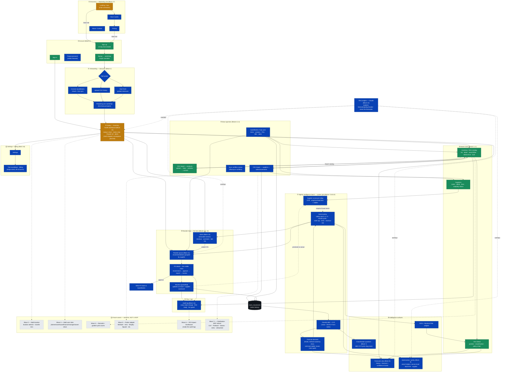

# The Chain — User Flow (full app, MVP + future buildouts)

*Authored 2026-06-03. A user-journey map across all 17 Wave-1 feature blocks plus
the wired-for future waves (2-7). Color = build status. This is intentionally big.*

**How to view it visually:**
- Open `docs/user-flow.html` in a browser (renders the diagram with pan/zoom), OR
- View this file on GitHub (it renders the ```mermaid``` block below), OR
- Paste the mermaid block into https://mermaid.live.

## Legend

| Color | Meaning |
|---|---|
| 🟢 Green | Shipped / live today |
| 🟠 Amber | Partial — shell or slice built |
| 🔵 Cobalt | Planned — Wave 1 MVP (next to build) |
| ⬛ Dark | System / background job (no direct user action) |
| ⬜ Gray dashed | Future wave (2-7), wired-for, not in MVP |



## Future-buildout notes (what the gray nodes mean, and when)

- **Wave 2 — Multi-location.** Schema already carries on-hand / allocated / in-transit
  *per location*. UI adds a location selector + location-aware dashboards + inter-location
  transfer recommendations. No schema change.
- **Wave 3 — Multi-user + roles.** RLS roles (planner / warehouse / finance / manager /
  owner) are defined from day one; Wave 1 only exposes owner. Wave 3 lights up
  role-specific dashboards + a lightweight "one number everyone reads" S&OP layer.
- **Wave 4 — Barcode + cycle counts.** Count-session + variance schema is in place.
  Browser-based scanning + guided counts, no native app.
- **Wave 5 — Rutter adapter.** Same `SourceAdapter` seam the CSV + QBO adapters already
  implement. Flipping it on adds NetSuite, Acumatica, Sage Intacct, Dynamics 365 BC,
  Xero, Shopify, Square, Clover. Adapter activation, not a rebuild.
- **Wave 6 — ROI Impact Dashboard.** Reads the audit log that's been writing since Day 1.
  Tracks stockout reduction, inventory reduction, expediting cost, payback. (Also the
  home of the optimization-tightening loop in `INVENTORY_OPTIMIZATION_NOTES.md`.)
- **Wave 7+ — Distribution-ERP natives.** Per-customer paid native adapters when a real
  customer needs one. Same adapter contract.

## The MVP spine (read this if nothing else)

The shortest path a paying distributor walks:

**Sign up → connect QBO or upload CSV → catalog + sales land → nightly batch forecasts
+ classifies + sets policy → /today shows what's at risk → alert says "reorder 47 cases
by Wed" → approve the PO → it writes back to QuickBooks → receive it → on-hand updates
and the supplier's reliability score sharpens the next recommendation.**

Everything green is built. Everything cobalt is the MVP work remaining (Tranches B-F).
Everything gray waits for a real customer to pull it forward.
